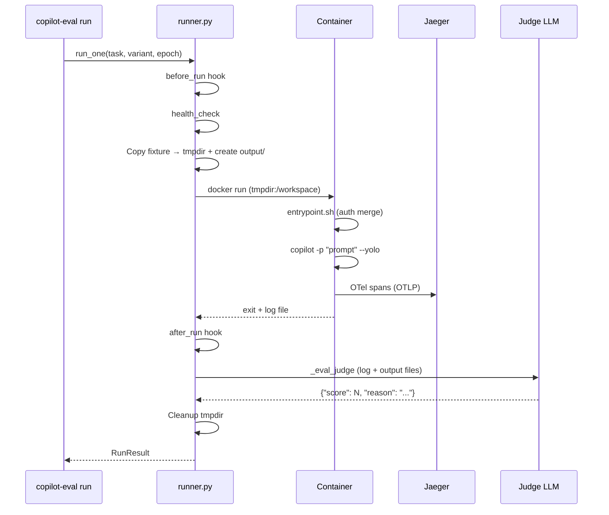

# Architecture

## Overview

```
eval-config.yaml
       ↓
  copilot-eval build     → Docker images per variant
  copilot-eval run       → Containers → OTel → Jaeger
  copilot-eval analyze   → Traces → A/B report
```

## Components

```
eval/
├── cli.py        Click CLI: list, build, run, analyze
├── config.py     YAML config → dataclasses (Config, Task, Variant, Evaluator, Hooks)
├── runner.py     Single eval run: hooks → Docker container → evaluators
├── trace.py      Jaeger API: fetch + parse OTel traces
└── report.py     A/B comparison: build_report() → format_table/json/markdown

docker/
├── Dockerfile     Base image: Node 20 + Copilot CLI (version pinned)
└── entrypoint.sh  Auth merge + setup script execution
```

## Execution Flow



## Docker Design

### Base Image

`docker/Dockerfile` provides a minimal base:
- `node:20-slim` + Copilot CLI (version pinned via `COPILOT_VERSION`)
- `entrypoint.sh` handles auth merging

### Variant Images

Each variant extends the base with its own Dockerfile:

```dockerfile
FROM copilot-eval:base
# Install tools, plugins, etc.
RUN copilot plugin install microsoft/azure-skills
```

### COPILOT_HOME

COPILOT_HOME **must be writable** inside the container. The entrypoint merges host auth (`logged_in_users`, `last_logged_in_user`, `staff`) into a writable copy, preserving image-side config like `installed_plugins`.

### Workspace

Fixtures are copied to a host tmpdir and mounted as `/workspace` (read-write). An `output/` subdirectory is created automatically for Copilot to write artifacts. The tmpdir is cleaned up in a `finally` block after evaluators run.

## OTel Tracing

Copilot CLI emits spans for each agent session:

```
invoke_agent (root)
  ├── chat {model}          # LLM API call (tokens in tags)
  ├── execute_tool {name}   # Tool execution
  │   └── permission
  └── chat {model}          # Next turn
```

Tags include `input_tokens`, `output_tokens`, `cache_read_input_tokens`, `tool.name`, etc.

`trace.py` fetches spans from Jaeger's HTTP API, filtering by `eval.run_id` and `eval.test_id` resource attributes.

## Report Generation

`report.py` builds per-task A/B comparisons:

1. Groups results by task
2. Fetches traces from Jaeger for each run
3. Computes metrics (duration, turns, tokens, tool calls)
4. Supports three aggregation modes:
   - **paired** (default): Per-epoch delta → median
   - **median**: Independent median per variant
   - **mean**: Independent mean per variant
5. Outputs as table, JSON, or Markdown
